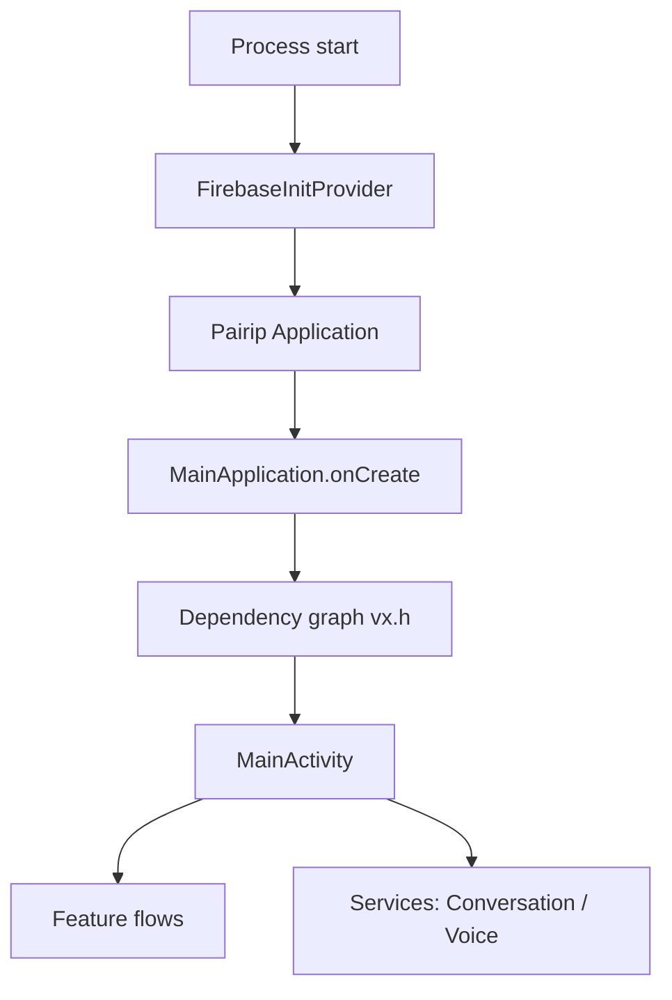

# Architecture Overview

## High‑level structure
Key packages under `com/openai`:
- `com/openai/chatgpt/*` — app entry points, app class, resources.
- `com/openai/apps/appbase/*` — app‑base startup wiring.
- `com/openai/feature/*` — feature modules (conversation, voice, onboarding, commerce, etc.).
- `com/openai/voice/*` — voice + assistant activity/services.
- `com/openai/serialization/*` — custom serialization annotations.
- `com/openai/platform/*` — platform utility (e.g., URI helpers).

Non‑OpenAI packages of interest:
- `com/pairip/*` — wrapper application + license checks.
- `io/ktor/*` + `okhttp3/*` — networking.
- `io/sentry/*`, `com/datadog/*`, `io/opentelemetry/*` — telemetry.
- `io/livekit/*` + `livekit/org/webrtc/*` — real‑time audio.

## Dependency graph (DI)
The app uses a large dependency graph stored on the Application instance.

- Graph accessor: `chatgpt-base_jadx/sources/ct/b.java` (`ct.b.P(context)`)
- Graph container: `chatgpt-base_jadx/sources/vx/h.java`
  - Holds many providers and feature wiring

## Entry points
- Application wrapper (manifest): `chatgpt-base_apktool/AndroidManifest.xml` → `com.pairip.application.Application`
- OpenAI app class: `chatgpt-base_jadx/sources/com/openai/chatgpt/app/MainApplication.java`
- Main activity: `chatgpt-base_jadx/sources/com/openai/chatgpt/MainActivity.java`
- Startup provider: `chatgpt-base_jadx/sources/com/openai/apps/appbase/app/startup/FirebaseInitProvider.java`
- Foreground services:
  - Conversation streaming: `chatgpt-base_jadx/sources/com/openai/feature/conversations/impl/coordinator/ConversationStreamingService.java`
  - Voice mode: `chatgpt-base_jadx/sources/com/openai/voice/webrtc/VoiceModeForegroundService.java`
- Quick Settings tile: `chatgpt-base_jadx/sources/com/openai/feature/voice/impl/quicktile/QuickTileService.java`

## Lifecycle flow (inferred)

## Runtime dependencies (observed)
- Ktor client + OkHttp engine for networking: `chatgpt-base_jadx/sources/io/ktor/client/engine/okhttp/OkHttpEngineContainer.java`
- WebSocket support via Ktor: `chatgpt-base_jadx/sources/io/ktor/websocket/*`
- LiveKit + WebRTC for voice: `chatgpt-base_jadx/sources/io/livekit/*` and `chatgpt-base_jadx/sources/livekit/org/webrtc/*`
- Sentry + Datadog + OpenTelemetry for logging/telemetry: `chatgpt-base_jadx/sources/io/sentry/*`, `chatgpt-base_jadx/sources/com/datadog/*`, `chatgpt-base_jadx/sources/io/opentelemetry/*`

## Obfuscation boundary
`com/openai/*` is mostly readable; the rest of the codebase (e.g., `a1/`, `bq/`, `mk0/`) is likely obfuscated app internals or third‑party libraries.
