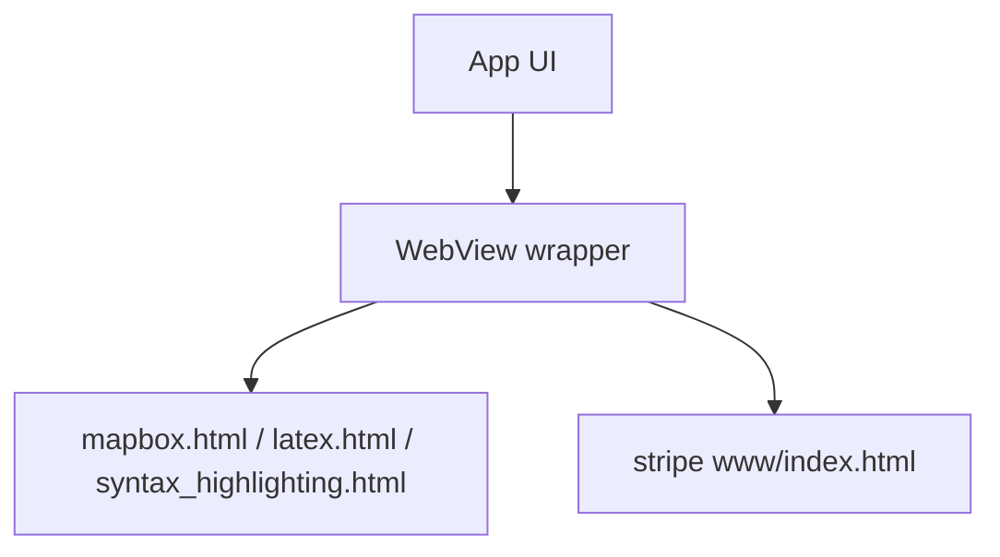

# Assets & Embedded Web Content

This APK ships several HTML/JS/CSS assets used for WebView‑based rendering or embedded UI.

## Key assets
- Mapbox viewer: `chatgpt-base_apktool/assets/mapbox.html`, `chatgpt-base_apktool/assets/mapbox.js`
- Syntax highlighting: `chatgpt-base_apktool/assets/syntax_highlighting.html`, `chatgpt-base_apktool/assets/syntax_highlighting.js`, `chatgpt-base_apktool/assets/highlight.min.js`, `chatgpt-base_apktool/assets/theme.css`
- LaTeX rendering: `chatgpt-base_apktool/assets/latex.html`, `chatgpt-base_apktool/assets/latex.js`, `chatgpt-base_apktool/assets/latex.min.js`
- Stripe web integration: `chatgpt-base_apktool/assets/www/index.html`, `chatgpt-base_apktool/assets/www/native.js`
- Stripe bank‑info data: `chatgpt-base_apktool/assets/au_becs_bsb.json`

## Likely usage

## Notes
- External dependencies referenced in assets include Mapbox and Stripe JS.
- These files often render rich content (maps, math, syntax highlighting) inside Compose‑based UI.
