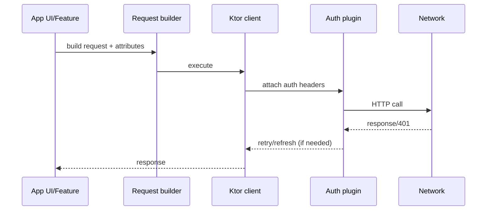

# Auth / API Authentication Notes (decompiled Android app)

This document summarizes the observed authentication flows, how auth is applied to API requests, and how external SDK calls are authenticated based on the decompiled sources under `chatgpt-base_jadx/`.

## Summary
- Primary auth is Auth0/OIDC via `auth.openai.com`, with access/id/refresh tokens stored locally and refreshed in the background.

## Auth pipeline overview (inferred)

- API requests are routed through a Ktor client with an auth plugin. Requests are tagged with auth-mode attributes (NoAuth/MixedAuth/etc.). The auth plugin asks per-request auth providers to attach headers.
- Several external SDKs use their own auth schemes (Stripe Bearer, Google Places API key, Firebase Installations, Persona bearer + device ID).
- No references to Workday were found in the decompiled sources.

## Auth0 / OpenAI Auth Flow
- **Authorize endpoint**: `https://auth.openai.com/api/accounts/authorize` with scopes `openid email profile offline_access model.request model.read organization.read organization.write`. (`chatgpt-base_jadx/sources/sx/a.java`)
- **Audience**: `https://api.openai.com/v1`. (`chatgpt-base_jadx/sources/kr0/g.java` -> method `i()`)
- **Token exchange**: OAuth token exchange grant for Google ID tokens: `urn:ietf:params:oauth:grant-type:token-exchange` and subject token type `http://auth0.com/oauth/token-type/google-id-token`. (`chatgpt-base_jadx/sources/wg/a.java`)
- **Token storage**: Auth0 credentials saved in SharedPreferences `com.auth0.authentication.storage` with keys like `com.auth0.access_token`, `com.auth0.refresh_token`, `com.auth0.id_token`, `com.auth0.expires_at`. (`chatgpt-base_jadx/sources/xg/c.java`, `chatgpt-base_jadx/sources/xg/a.java`)
- **Refresh**: Background refresh via `Auth0AuthTokenRefresher` and `AccessTokenRefreshWorker`. (`chatgpt-base_jadx/sources/mz/n.java`, `chatgpt-base_jadx/sources/com/openai/feature/auth/impl/AccessTokenRefreshWorker.java`)

## Base URLs / API Surfaces
Known OpenAI endpoints appear in `mi0/o.java`, including:
- `https://android.chat.openai.com/backend-api/`
- `https://android.chat.openai.com/backend-anon/`
- `https://android.chat.openai.com/graphql`
- `https://android.chat.openai.com/public-api/`
- `https://realtime.chatgpt.com/v1`
- `https://auth.openai.com/`

## Auth Modes (request attributes)
Requests are tagged with auth-mode attributes used by the networking stack:
- `NoAuth`, `MixedAuth`, `NoAccountId`, `NoIntegrityCheck`, `FailOnPlayIntegrity`, `BodyIntegrityCheck`. (`chatgpt-base_jadx/sources/mi0/p.java`)

Examples of where these are applied:
- **NoAuth + NoIntegrityCheck** for auth endpoints (pre-auth flows): `id0/c.java`, `ci0/b.java`.
- **MixedAuth** for many authenticated OpenAI endpoints (e.g., models, system_hints, sentinel, me, etc.): `f60/k2.java`, `o60/i2.java`, `io/ktor/websocket/h.java`.

## Deeper Trace: How auth headers get attached
Below is the observed request path from call sites to auth header injection:

### 1) Call sites build a request (`kz0.d`)
Typical pattern:
- Create `kz0.d` (request builder), set method via `pz0.d0` (GET/POST), set path via `kz0.e.b(...)`, attach body and attributes.
- Add auth-mode attributes via `dVar.f36363f.f(mi0.p.<mode>, Unit)`.

Examples:
- `f60/k2.java` adds `mi0.p.f40650b` (MixedAuth) on several endpoints.
- `og0/n.java` toggles MixedAuth for `generate_autocompletions` vs anon.
- `id0/c.java` adds `NoAuth` + `NoIntegrityCheck` for `api/accounts/authorize`.

### 2) Requests are executed via Ktor client (`wy0.c`)
- `wy0.c.j(kz0.d, ...)` runs the Ktor pipeline (`kz0.f`). (`chatgpt-base_jadx/sources/wy0/c.java`)

### 3) Ktor Auth plugin is installed and configured
- The Auth plugin is registered via `io.ktor.client.plugins.auth.h.f28740c`.
- Providers are collected into a `Set` and added using `f60/b2`, which inserts them into `io.ktor.client.plugins.auth.b.f28717a`.
- This happens when building a client via `fg0/t.java` and `az0/j.java`.

Files:
- Client config: `chatgpt-base_jadx/sources/fg0/t.java` (case 3)
- Alternate config path: `chatgpt-base_jadx/sources/az0/j.java` (case 2)
- Provider list storage: `chatgpt-base_jadx/sources/io/ktor/client/plugins/auth/b.java`

### 4) Auth plugin hooks the request pipeline
- `f3/n6.java` installs the auth request and response interceptors into Ktor (`dz0.g` stages):
  - Request hook: `io.ktor.client.plugins.auth.d`
  - Response hook: `io.ktor.client.plugins.auth.e`

### 5) Auth headers are attached per provider
- `io.ktor.client.plugins.auth.d` iterates providers and calls `qi0.g.a(kz0.d, ...)`, logging "Adding auth headers...". (`chatgpt-base_jadx/sources/io/ktor/client/plugins/auth/d.java`)
- The provider type is `qi0.g` (its `a(...)` method is the per-request header injection point).
- The actual header keys are inside the provider implementation (the method is decompiled but not fully readable); however the auth client treats `Authorization` as a sensitive header and redacts it in logs. (`chatgpt-base_jadx/sources/lz/f0.java`)

### 6) Response challenges / refresh
- `io.ktor.client.plugins.auth.e` is the response hook for auth challenges / retries. (`chatgpt-base_jadx/sources/io/ktor/client/plugins/auth/e.java`)
- The provider set and a per-provider atomic counter are used to avoid infinite loops. (`io/ktor/client/plugins/auth/d.java`, `io/ktor/client/plugins/auth/a.java`)

## Device ID and Integrity for Auth
- OAuth token/revoke calls add `OAI-Device-Id` header; optionally include `device_id` query param for `/oauth/token`. (`chatgpt-base_jadx/sources/lz/m0.java`)
- Auth domain is rewritten from `auth.openai.com` to `auth.openai.com/api/accounts` for token flows. (`chatgpt-base_jadx/sources/lz/m0.java`)
- Play Integrity / Body Integrity checks are modeled as request attributes/plugins (`bi0/c.java`, `mi0/p.java`).

## External APIs & Auth Schemes
- **Stripe**: `Authorization: Bearer <key>` plus Stripe headers. (`chatgpt-base_jadx/sources/no0/f0.java`)
- **Google Places**: API key configured via `google_places_api_key`. (`chatgpt-base_jadx/sources/yy/z0.java`)
- **Firebase Installations**: `Authorization: FIS_v2 <token>`. (`chatgpt-base_jadx/sources/rt/c.java`)
- **Persona** (identity verification): `Authorization` bearer + `Persona-Device-Id`. (`chatgpt-base_jadx/sources/hw0/b0.java`)

## Workday?
No references to “Workday” (string or domain) were found in the decompiled sources under `chatgpt-base_jadx/` or `chatgpt-base_apktool/`.

