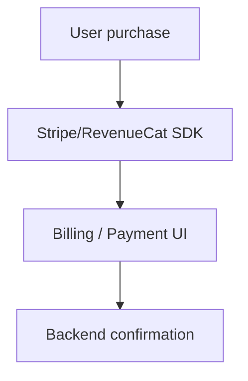

# Commerce & Billing

## Stripe
Stripe activities appear extensively in the manifest (PaymentSheet, Google Pay, 3DS2, etc.). See:
- `chatgpt-base_apktool/AndroidManifest.xml` entries for `com.stripe.android.*`
- WebView asset: `chatgpt-base_apktool/assets/www/index.html` (loads `https://js.stripe.com/v3/`)
- Payment method assets: `chatgpt-base_jadx/resources/lpms.json` (Stripe PM icons/metadata)

## RevenueCat
RevenueCat purchase activities are present:
- `chatgpt-base_apktool/AndroidManifest.xml` → `com.revenuecat.purchases.*`

## Billing client
Google Play Billing activities are present:
- `chatgpt-base_apktool/AndroidManifest.xml` → `com.android.billingclient.api.ProxyBillingActivity*`

## Inferred flow

## Notes
- Stripe assets are bundled; web‑based flows are embedded via WebView.
- RevenueCat implies server‑side subscription management.
