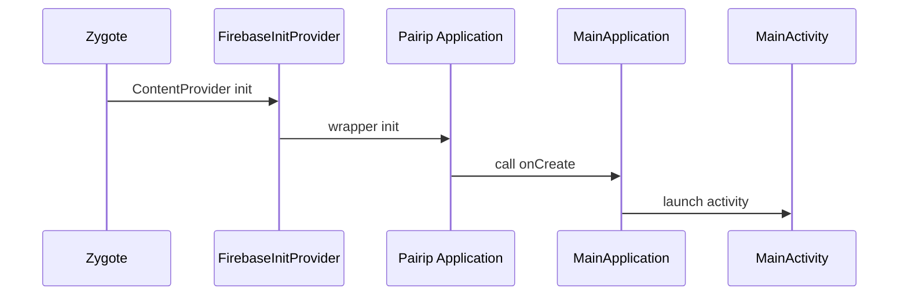

# App Entry Points & Lifecycle

## Application
- `chatgpt-base_jadx/sources/com/openai/chatgpt/app/MainApplication.java`
  - Sets up Sentry performance tracking.
  - Triggers `StartupLauncher.launch()` (Pairip wrapper).
  - Initializes app dependencies via a lazy graph (`vx.h`).

## DI graph
- Graph accessor: `chatgpt-base_jadx/sources/ct/b.java` → `ct.b.P(context)`
- Graph container: `chatgpt-base_jadx/sources/vx/h.java`

## Main activity
- `chatgpt-base_jadx/sources/com/openai/chatgpt/MainActivity.java`
  - Extends an obfuscated base activity.
  - On first launch (`bundle == null`) resolves a binding and passes the intent to a handler (likely deep‑link/share handling).

## Startup provider
- `chatgpt-base_jadx/sources/com/openai/apps/appbase/app/startup/FirebaseInitProvider.java`
  - ContentProvider entry point that initializes Firebase before `Application.onCreate`.

## Services
- Conversation stream: `chatgpt-base_jadx/sources/com/openai/feature/conversations/impl/coordinator/ConversationStreamingService.java`
- Voice foreground service: `chatgpt-base_jadx/sources/com/openai/voice/webrtc/VoiceModeForegroundService.java`
- Quick settings tile: `chatgpt-base_jadx/sources/com/openai/feature/voice/impl/quicktile/QuickTileService.java`

## Lifecycle flow (inferred)

