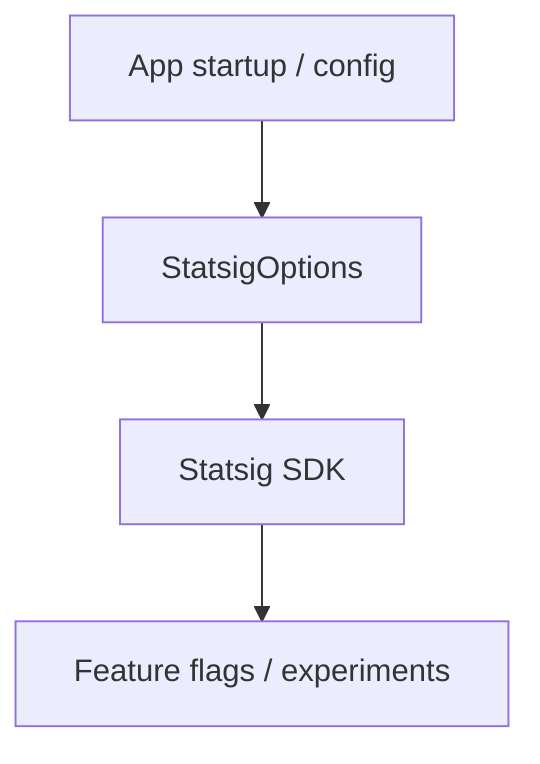

# Experimentation / Feature Flags

## Statsig usage
A Statsig configuration builder is present:
- `chatgpt-base_jadx/sources/yy/nc.java`
  - Uses endpoint: `https://ab.chatgpt.com/v1`
  - Builds `StatsigOptions` with tiered environment settings
  - Attaches metadata (client type, version code, auth status, device manufacturer, device tier)

## Inferred flow

## Notes
- This is a strong indicator that feature flags and A/B testing are powered by Statsig.
- Search for `Statsig` references to trace gating conditions.
