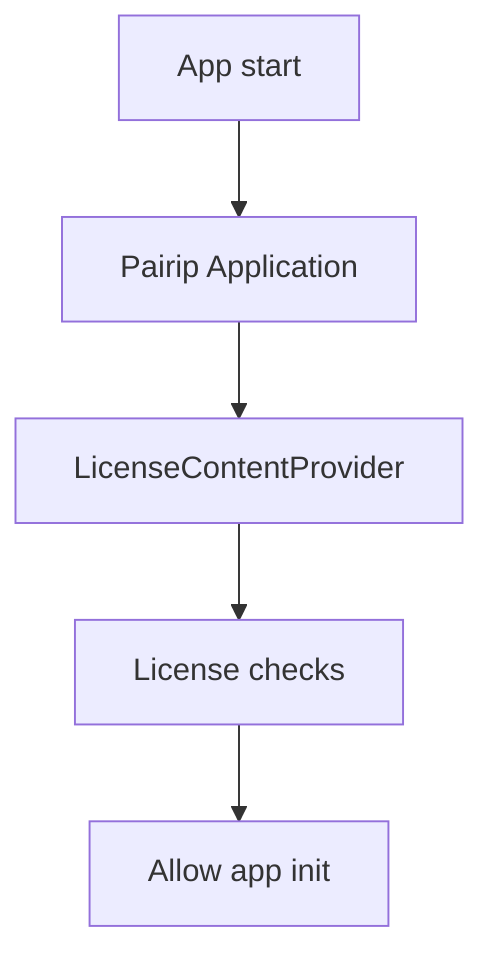

# Licensing & Protection

The APK embeds Pairip for license verification and application wrapping.

## Key classes
- Application wrapper: `chatgpt-base_jadx/sources/com/pairip/application/Application.java`
- Startup/initialization: `chatgpt-base_jadx/sources/com/pairip/InitContextProvider.java`
- License checks: `chatgpt-base_jadx/sources/com/pairip/licensecheck/*`
- Signature checks: `chatgpt-base_jadx/sources/com/pairip/SignatureCheck.java`

## Manifest hooks
- License activity: `chatgpt-base_apktool/AndroidManifest.xml` → `com.pairip.licensecheck.LicenseActivity`
- License provider: `chatgpt-base_apktool/AndroidManifest.xml` → `com.pairip.licensecheck.LicenseContentProvider`
- Permission: `com.android.vending.CHECK_LICENSE`

## Inferred flow

## Notes
- Pairip is commonly used to harden apps and enforce Play Store licensing.
- The OpenAI `MainApplication` is not the manifest application class; it is invoked after Pairip initialization.
