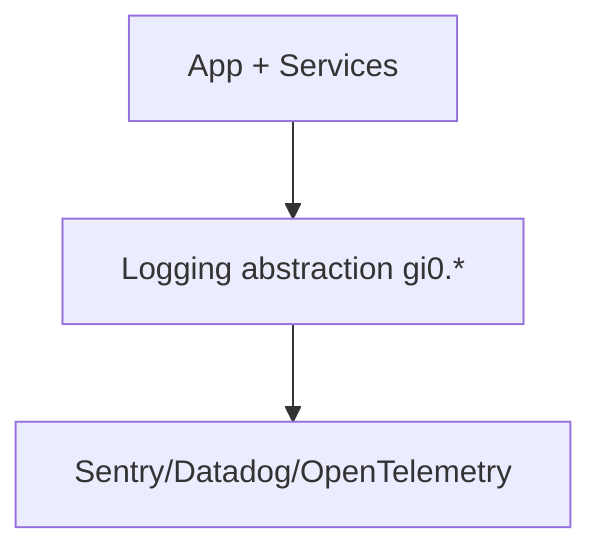

# Logging & Telemetry

## Logging abstraction
- Logger interface: `chatgpt-base_jadx/sources/gi0/a.java`
- Logger registry/sinks: `chatgpt-base_jadx/sources/gi0/b.java`
- Logger wrapper + levels: `chatgpt-base_jadx/sources/gi0/c.java`

Most feature modules obtain loggers via `kk.c.m0(level, "Tag")` and route through `gi0.c`.

## Observed SDKs
- Sentry: `chatgpt-base_jadx/sources/io/sentry/*`
- Datadog: `chatgpt-base_jadx/sources/com/datadog/*`
- OpenTelemetry: `chatgpt-base_jadx/sources/io/opentelemetry/*`

## App integration points
- App startup uses Sentry performance tracking in `chatgpt-base_jadx/sources/com/openai/chatgpt/app/MainApplication.java`
- Services log lifecycle events via Sentry: 
  - `chatgpt-base_jadx/sources/com/openai/feature/conversations/impl/coordinator/ConversationStreamingService.java`
  - `chatgpt-base_jadx/sources/com/openai/voice/webrtc/VoiceModeForegroundService.java`

## Telemetry flow (inferred)

## HTTP request telemetry
- Request outcome logging + sampling: `chatgpt-base_jadx/sources/mi0/l.java`

## Notes
- Many logs are routed through obfuscated wrappers; `gi0.c` is the consistent anchor.
- For deeper event taxonomy, search for `event`/`analytics` strings and track caller chains.
