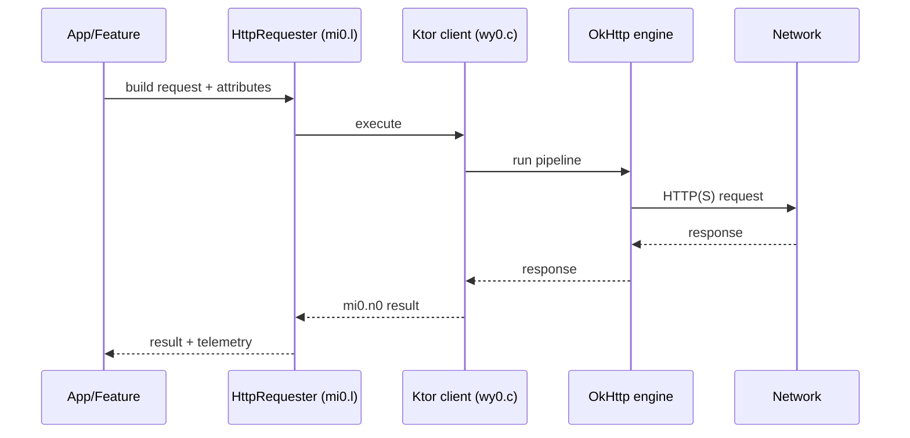

# Networking

## Observed stack
The APK bundles Ktor client with the OkHttp engine. Most HTTP calls appear to go through Ktor’s `HttpClient` with OkHttp as the engine.

Key package anchors:
- OkHttp engine container: `chatgpt-base_jadx/sources/io/ktor/client/engine/okhttp/OkHttpEngineContainer.java`
- Ktor client core: `chatgpt-base_jadx/sources/io/ktor/client/*`
- Ktor auth plugin: `chatgpt-base_jadx/sources/io/ktor/client/plugins/auth/*`
- OkHttp internals: `chatgpt-base_jadx/sources/okhttp3/internal/*`

## Base URLs / endpoints (from code)
Centralized in:
- `chatgpt-base_jadx/sources/mi0/o.java`

Notable endpoints:
- `https://chatgpt.com/`
- `https://android.chat.openai.com/backend-api/`
- `https://android.chat.openai.com/backend-anon/`
- `https://android.chat.openai.com/graphql`
- `https://android.chat.openai.com/public-api/`
- `https://sora.chatgpt.com/backend/`
- `https://api.openai.com`
- `https://auth.openai.com/`
- `https://realtime.chatgpt.com/v1`
- Telemetry endpoints:
  - `https://android.chat.openai.com/ces/statsc/flush`
  - `https://android.chat.openai.com/ces/v1/telemetry/intake`
- Legal:
  - `https://openai.com/terms/`
  - `https://openai.com/privacy/`

## Host allowlist + request attributes
- Request flags & integrity settings: `chatgpt-base_jadx/sources/mi0/p.java`
  - `NoAuth`, `MixedAuth`, `NoAccountId`, `NoIntegrityCheck`, `FailOnPlayIntegrity`, `BodyIntegrityCheck`
  - Allowlist: `openai.com`, `chatgpt.com`, `chatgpt-staging.com`, `api.openai.org`

## Request execution + telemetry
- HTTP requester (metrics + sampling): `chatgpt-base_jadx/sources/mi0/l.java`
- Response wrapper types: `chatgpt-base_jadx/sources/mi0/n0.java` (success/error subclasses)
- Ktor client wrapper: `chatgpt-base_jadx/sources/wy0/c.java`

## External domains surfaced in code/resources
- Experimentation / feature flags (Statsig): `https://ab.chatgpt.com/v1` (`chatgpt-base_jadx/sources/yy/nc.java`)
- Static media: `https://persistent.oaistatic.com/...` (`chatgpt-base_jadx/sources/yy/b1.java`)
- Stripe JS: `https://js.stripe.com/v3/` (`chatgpt-base_apktool/assets/www/index.html`)
- Mapbox JS/CSS: `https://api.mapbox.com/mapbox-gl-js/...` (`chatgpt-base_apktool/assets/mapbox.html`)

## Typical request flow (inferred)

## Notes
- There is no obvious Retrofit package in the decompiled tree.
- OkHttp is present; it appears to be the runtime engine under Ktor rather than direct usage.
