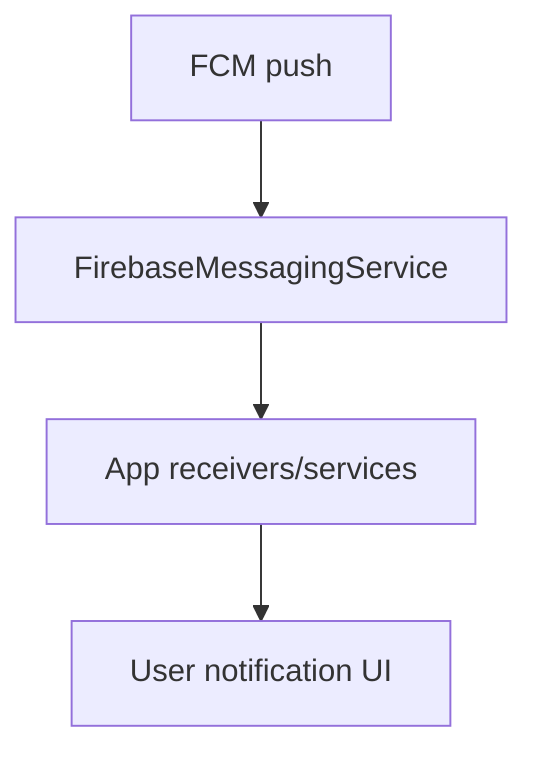

# Notifications & Push

## Firebase Messaging
Firebase messaging components are present in the manifest:
- `com.google.firebase.messaging.FirebaseMessagingService`
- `com.google.firebase.iid.FirebaseInstanceIdReceiver`

Proto schemas:
- `chatgpt-base_jadx/resources/messaging_event.proto`
- `chatgpt-base_jadx/resources/messaging_event_extension.proto`

## App notification components
- Notification receiver: `chatgpt-base_jadx/sources/com/openai/feature/notification/impl/NotificationBroadcastReceiver.java`
- App update receiver: `chatgpt-base_jadx/sources/com/openai/feature/notification/impl/AppUpdateReceiver.java`
- Notification service: `chatgpt-base_jadx/sources/com/openai/feature/notification/impl/NotificationService.java`
- Registration workers:
  - `chatgpt-base_jadx/sources/com/openai/feature/notification/impl/NotificationRegisterWorker.java`
  - `chatgpt-base_jadx/sources/com/openai/feature/notification/impl/NotificationDeregisterWorker.java`

## Inferred flow

## Notes
- Notification handling is split between Firebase infrastructure and app‑specific receivers/services.
- Look for deep‑link handling in `MainActivity` and feature entry points when a notification is opened.
