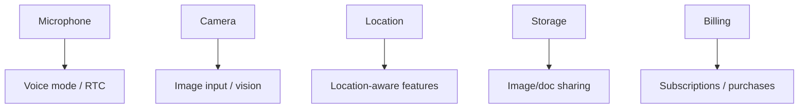

# Permissions & Capabilities

Derived from `chatgpt-base_apktool/AndroidManifest.xml`.

## Core permissions
- Internet access: `android.permission.INTERNET`
- Notifications: `android.permission.POST_NOTIFICATIONS` (SDK 33+)
- Microphone / voice: `android.permission.RECORD_AUDIO`, `android.permission.FOREGROUND_SERVICE_MICROPHONE`
- Media projection: `android.permission.FOREGROUND_SERVICE_MEDIA_PROJECTION`
- Camera: `android.permission.CAMERA`
- Location: `android.permission.ACCESS_COARSE_LOCATION`, `android.permission.ACCESS_FINE_LOCATION`
- Storage/media: `android.permission.READ_MEDIA_IMAGES`, `android.permission.READ_MEDIA_VISUAL_USER_SELECTED` (and `READ_EXTERNAL_STORAGE` for older SDK)
- Network state: `android.permission.ACCESS_NETWORK_STATE`, `android.permission.ACCESS_WIFI_STATE`
- Wake lock / vibration: `android.permission.WAKE_LOCK`, `android.permission.VIBRATE`
- Biometrics: `android.permission.USE_BIOMETRIC`, `android.permission.USE_FINGERPRINT`
- Billing: `com.android.vending.BILLING`

## Hardware features declared
- Camera (any/back/flash/autofocus) — optional
- Microphone — optional
- OpenGL ES 3.0 — required

## Capability map (inferred)

## Notes
- Foreground services are used for voice and media projection flows.
- The app declares a custom dynamic receiver permission: `com.openai.chatgpt.DYNAMIC_RECEIVER_NOT_EXPORTED_PERMISSION`.
