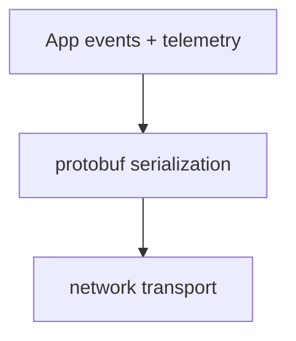

# Schemas & Protobuf

The APK bundles protobuf definitions in `chatgpt-base_jadx/resources/`.

## App schemas
- Client analytics: `chatgpt-base_jadx/resources/client_analytics.proto`
- Messaging events: `chatgpt-base_jadx/resources/messaging_event.proto`
- Messaging event extensions: `chatgpt-base_jadx/resources/messaging_event_extension.proto`

## Google protobuf types
Standard Google protobuf definitions are present:
- `chatgpt-base_jadx/resources/google/protobuf/*.proto`

## Usage (inferred)

## Notes
- These proto files provide strong hints about analytics/event payload structure, even if runtime code is obfuscated.
- Search for `client_analytics` and `messaging_event` references in the decompiled Java to locate serialization entry points.
