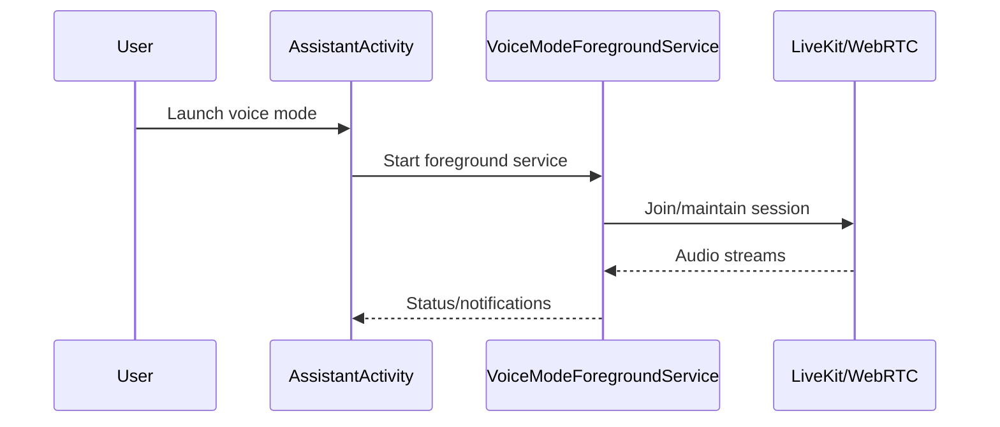

# Voice & Realtime

## Core components
- Assistant activity entry point: `chatgpt-base_jadx/sources/com/openai/voice/assistant/AssistantActivity.java`
- Voice mode foreground service: `chatgpt-base_jadx/sources/com/openai/voice/webrtc/VoiceModeForegroundService.java`
- Quick Settings tile: `chatgpt-base_jadx/sources/com/openai/feature/voice/impl/quicktile/QuickTileService.java`

## Media / RTC stack
- LiveKit Android SDK: `chatgpt-base_jadx/sources/io/livekit/android/*`
- WebRTC binding: `chatgpt-base_jadx/sources/livekit/org/webrtc/*`
- Additional RTC pipeline classes (obfuscated):
  - PeerConnection factory/device modules: `chatgpt-base_jadx/sources/dx/u0.java`
  - PeerConnection observer: `chatgpt-base_jadx/sources/dx/h1.java`
  - Audio/video pipeline: `chatgpt-base_jadx/sources/dx/f0.java`, `chatgpt-base_jadx/sources/dx/n1.java`, `chatgpt-base_jadx/sources/dx/r.java`
  - WebRTC logging: `chatgpt-base_jadx/sources/nf/c0.java`

## Voice lifecycle (inferred)

## Notes
- Foreground service handles notification channel creation and permission checks (RECORD_AUDIO).
- Quick Settings tile can launch voice flows directly.
